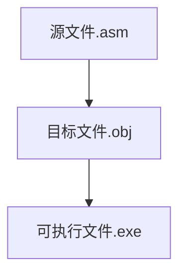

# 由源程序到程序运行


```assembly
assume cs:codesg
codesg segment
    mov ax,0123H
    mov bx,0456H
    add ax,bx
    add ax,ax
    
    mov ax,4c00H
    int 21H
codesg ends
end
```


## 写出源程序到执行可执行文件的过程


```assembly
; 文本编辑 --> 源程序文件.asm --> 编译 --> 目标文件.obj --> 连接 --> 可执行文件.exe --> 运行程序 --> 计算机 
```


## 编辑源程序


- 记事本
- edit.com
- visual C++
- EditPlus


## 编译


```powershell
c:\>masm p4-1.asm
```


```powershell
p4-1.asm
p4-1.OBJ
```


- 目标文件（*.OBJ）是我们对一个源程序进行编译要得到的最终结果。
- 列表文件（*.LST）是编译器将源程序编译为目标文件的过程中产生的中间结果。
- 交叉引用文件（*.CRF）同列表文件一样，是编译器将源程序编译为目标文件过程中产生的中间结果。
- 对源程序的编译结束，编译器输出的最后两行告诉我们这个源程序没有警告错误和必须要改正的错误。


## 连接


```powershell
c:\>link p4-1
```


- 可执行文件（.EXE）是我们对一个程序进行连接要得到的最终结果。
- 映像文件（.MAP）是连接程序将目标文件连接为可执行文件过程中产生的中间结果。
- 库文件（.LIB）里面包含了一些可以调用的子程序，如果我们的程序中调用了某一个库文件中的子程序，就需要在连接的时候，将这个库文件和我们的目标文件连接到一起，生成可执行文件。
-  no stack segment ，一个“没有栈段”的警告错误，可以不必理会这个错误。


- 连接中可能会遭遇错误
- 例
  - object nor found    -----   找不到对象


> 简化命令可以在命令后加    ---->   `;`
>
> 例如：
>
> link p4-1;


## 执行可执行程序


```powershell
c:\>p4-1
c:\>
```


- 我们的程序没有向显示器输出任何信息。程序只是做了一些将数据送入寄存器和加法的操作，而这些事情，我们不可能从显示器上看出来。
- 程序执行完成后，返回。屏幕上再次出现操作系统的提示符。


## 小结





