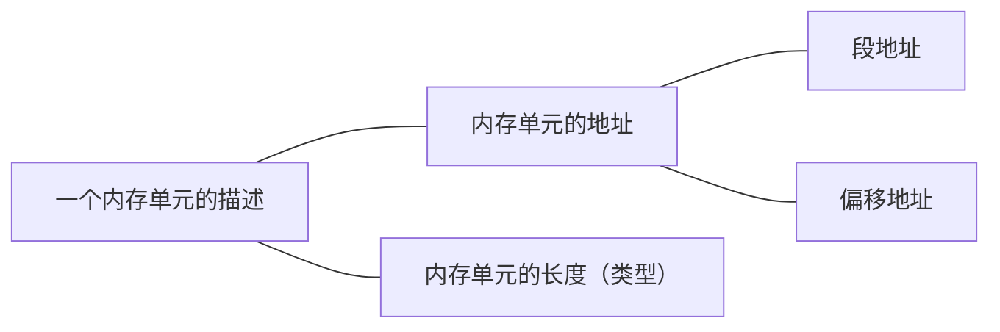

# []和()


## [] 的规定与 () 的约定


- [] -------- (**汇编语法规定**) 表示一个内存单元


|    指令     |  段地址  |  偏移地址  | 操作单位 |
| :---------: | :------: | :--------: | :------: |
| mov ax,[0]  | 在 DS 中 | 在 [0] 中  |    字    |
| mov al,[0]  | 在 DS 中 | 在 [0] 中  |   字节   |
| mov ax,[bx] | 在 DS 中 | 在 [bx] 中 |    字    |
| mov al,[bx] | 在 DS 中 | 在 [bx] 中 |   字节   |





- () --------（为了方便学习做出的约定）表示一个内存单元或寄存器中的内容


|      描述对象       |                 描述方法                 |          描述对象          |                 描述方法                 |
| :-----------------: | :--------------------------------------: | :------------------------: | :--------------------------------------: |
| ax 中的内容为 0010H |               (ax) = 0010H               | 2000:1000 处的内容为 0010H |             (21000H) = 0010H             |
|  mov ax,[2] 的功能  |            (ax) = ((ds)*16+2)            |     mov [2],ax 的功能      |            ((ds)*16+2) = (ax)            |
|   add ax,2 的功能   |              (ax) = (ax)+2               |      add ax,bx 的功能      |             (ax) = (ax)+(bx)             |
|   push ax 的功能    | (sp) = (sp)-2 <br> ((ss)*16+(sp)) = (ax) |       pop ax 的功能        | (ax) = ((ss)*16+(sp)) <br> (sp) = (sp)+2 |


## 再约定：符号 idata 表示常量


- 例

  - mov ax,[idata]：表示 mov ax,[1]、mov ax,[2]、mov ax,[3]、......

  - mov bx,idata：表示 mov bx,1、mov bx,2、mov bx,3、......
  - mov ds,idata：表示 mov ds,1、mov ds,2、mov ds,3、......


## 案例分析


```assembly
mov ax,2000H
mov ds,ax
mov bx,1000H
mov ax,[bx]
inc bx
inc bx
mov [bx],ax
inc bx
inc bx
mov [bx],ax
inc bx
mov [bx],al
inc bx
```


```assembly
BE    21000H
00    21001H
BE    21002H
00    21003H
BE    21004H
BE    21005H
BE    21006H
      21007H
```

