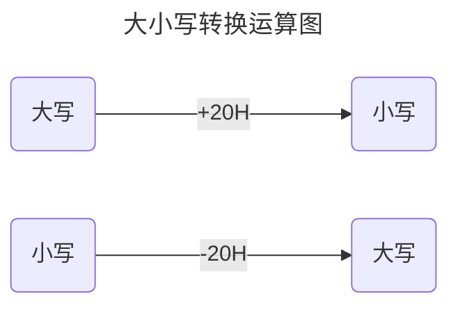

# 处理字符问题


汇编程序中，用 `''` 的方式指明数据是以字符的形式给出的，编译器将把他们转化为相对应的 ASCII 码。


```assembly
assume cs:code,ds:data

data segment
       db 'unIX'    ; db: 定义字节数据
       db 'forRK'
data ends

code segment
 start:mov al,'a'
       mov bl,'b'
       mov ax,4c00h
       int 21h
code ends
end start
```


>   DS:0,即 075A0H 是程序开始的地址，隔过 100H 程序段前缀......


| 大写 |  二进制  | 小写 |  二进制  |
| :--: | :------: | :--: | :------: |
|  A   | 01000001 |  a   | 01100001 |
|  B   | 01000010 |  b   | 01100010 |
|  C   | 01000011 |  c   | 01100011 |
|  D   | 01000100 |  d   | 01100100 |


>   [!NOTE]
>
>   小写字母的 ASCII 码比大写字母的 ASCII 码值大 20H





## 大小写转换的问题


```assembly
assume cs:code,ds:data

data segment
       db 'BaSiC'
       db 'iNfOrMaTiOn'
data ends

code segment
    ...
code ends
end start
```


-   问题：对 datasg 中的字符串
    -   第一个字符串：小写字母转换为大写字母
    -   第二个字符串：大写字母转换为小写字母


```assembly
b    62H    0110 0010B
B    42H    0100 0010B
```

```assembly
I    49H    0100 1001B
i    69H    0110 1001B
```


```assembly
      0110 0010 (b)
and   1101 1111
-----------------------
=     0100 0010 (B)
```

>   逻辑与指令：and dest,src


```assembly
      0110 0010 (I)
or    0010 0000
-----------------------
=     0110 1001 (i)
```

>   逻辑或指令：or dest,src


>   [!TIP]
>
>   对于第一个字符串，若是字母是小写，转成大写；否则不变（BASIC）
>
>   对于第二个字符串，若是字母大写，转成小写，否则不变（information）


## 程序：解决大小写转换问题


```assembly
assume cs:code,ds:data

data segment
       db 'BaSiC'
       db 'iNfOrMaTiOn'
data ends

code segment
 start:mov ax,datasg
       mov ds,ax
       
       ; 第一个字符串：小写字母转换为大写字母
       mov bx,0
       mov cx,5
     s:mov al,[bx]
       and al,11011111b
       mov [bx],al
       inc bx
       loop s
       
       ; 第二个字符串：大写字母转换为小写字母
       mov bx,5
       mov cx,11
    s0:mov al,[bx]
       or al,00100000b
       mov [bx],al
       inc bx
       loop s0
       
       mov ax,4c00h
       int 21h
code ends
end start
```


