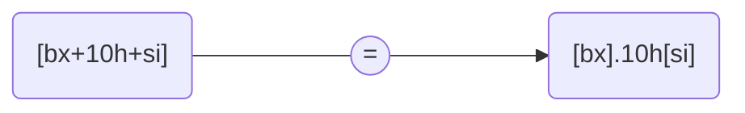

# 寻址方式的综合应用


## 应用问题


-   关于姚明 2001 年的一条记录
    -   姓名：Yao
    -   生日：'19800912'
    -   球衣号码：15
    -   场均得分：32
    -   效力球队：SHH(上海)
-   2002 年，姚明的信息有了变化
    1.  球衣号码变成了 11 号
    2.  场均得分为 13
    3.  效力球队变为了 NBA 的休斯顿火箭队（HOU）
-   **任务**
    -   **编程修改内存中的过时数据**


```assembly
                   ; 2001 年的数据                       ; 2002 年的数据
seg:60      +00    'Yao'             ------>            'Yao'
            +03    '19800912'        ------>            '19800912'
            +0C    15                ------>            11             ; 需要修改的数据
            +0E    32                ------>            13             ; 需要修改的数据
            +10    'SHH'             ------>            'HOU'          ; 需要修改的数据
```


## 解决方案


```assembly
mov ax,seg
mov ds,ax
mov bx,60h
mov word ptr [bx+0ch],11
mov word ptr [bx+0eh],13

mov si,0
mov byte ptr [bx+10h+si],'H'
inc si
mov byte ptr [bx+10h+si],'O'
inc si
mov byte ptr [bx+10h+si],'U'
```


>   [!NOTE]
>
>   汇编指令中寻址的其他防范
>
>   -   `[bx+idata]`
>       -   `[bx].idata`
>   -   `[bx+idata]+si`
>       -   `[bx].idata[si]`





## 和 C 语言处理方式的对比


```c
#include <stdio.h>
struct Player{
    char name[3];
    char birthday[9];
    int num;
    int ppg; // Points Per Game
    char team[3];
}

struct Player yao = {"Yao", "19800912", 15, 32, "SHH"};

int main(){
    int i;
    yao.num = 11;
    yao.ppg = 13;
    i = 0;
    yao.team[i] = 'H';
    i++;
    yao.team[i] = 'O';
    i++;
    yao.team[i] = 'U';
    return 0;
}
```


-   本质上是一样的，相等的

    -   `yao.team[i]` : `yao` 是一个变量名，指明了**结构体变量的地址**；`team` 是一个名称，指明了**数据项** `team` 的地址；`i` 用来定位 `team` 中的字符。

    -   用 `bx` 定位整个**结构体**；用 `idata` 定位结构体中的某一个**数据项**；用 `si` 定位**数据项中的元素**。


>   [!IMPORTANT]
>
>   8086 CPU 提供的如 `[bx+si+idata]` 的寻址方式为结构化数据的处理提供了方便，使得我们可以在编程的时候从结构化的角度去看待所要处理的数据。

