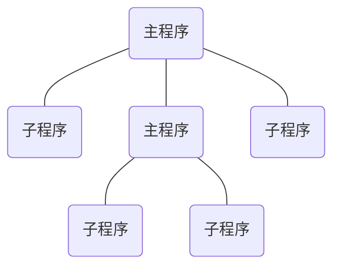

# call 指令和 ret 指令


## 模块化程序设计





```c
#include <stdio.h>

int cube(int x);

int main(){
    printf("%\n",cube(2));
    return 0;
}

int cube(int x){
    int f;
    f = x * x;
    f = f * x;
    return f;
}
```


-   调用子程序：`call 指令`

-   返回：`ret 指令`

-   示例

    -   ```assembly
            mov ax,0
            call s
            mov ax,4c00h
            int 21h
          s:add ax,1
            ret
        ```

-   实质：流程转移指令，它们都修改 IP，或同时修改 CS 和 IP


## call 指令


-   字面意思：调用子程序
-   实质：流程转移
    -   call 指令实现转移的方法和 jmp 指令的原理相似
-   格式：`call 标号`
-   CPU 执行 call 指令，进行两步操作
    1.  将当前的 IP 或 CS 和 IP 压入栈中
    2.  转移到标号处执行指令
-   call 标号
    -   16 位位移 = “标号” 处的地址 - call 指令后的第一个字节的地址
    -   16 位位移的范围为：-32768~32767，用补码表示
    -   16 位位移由编译程序在编译时算出


```assembly
    mov ax,0
    call s
    mov ax,4c00h
    int 21h
  s:add ax,1
    ret
```

>   [!NOTE]
>
>   相当于：
>
>   ```assembly
>   push IP
>   jmp near ptr 标号
>   ```


>   [!NOTE]
>
>   call 标号
>
>   -   ```assembly
>       (sp) = (sp) - 2
>       ((ss)*16+(sp))=(IP)
>       ```
>
>   -   ```assembly
>       (IP) = (IP) + 16位位移
>       ```


## 指令 “call far ptr 标号” 实现的是段间转移


-   CPU 执行 “call far ptr 标号” 时的操作

    1.  ```assembly
        (sp)=(sp)-2
        ((ss)*16+(sp))=(CS)
        (sp)=(sp)-2
        ((ss)*16+(sp))=(IP)
        ```

    2.  ```assembly
        (CS)=标号所在的段地址
        (IP)=标号所在的偏移地址
        ```

-   “call far ptr 标号” 相当于

    -   ```assembly
        push CS
        push IP
        jmp far ptr 标号
        ```


```assembly
    mov ax,0
    call far ptr s
    
    ...
    mov ax,4c00h
    int 21h
  s:add ax,1
    ret
```


>   [!NOTE]
>
>   -   "call 标号" 类似于 “jmp near ptr 标号”，对应机器指令中为相对于当前 IP 的转移位移，而不是转移的目的地址，实现段内转移
>   -   指令 “call far ptr 标号” 实现的是段间转移！


## 转移地址在寄存器中的 call 指令


-   指令格式

    -   `call 16位寄存器`

-   功能

    -   ```assembly
        (sp)=(sp)-2
        ((ss)*16+(sp))=(IP)
        (IP)=(16位寄存器)
        ```

-   相当于进行

    -   ```assembly
        push IP
        jmp 16位寄存器
        ```


```assembly
    mov ax,0
    call ax
    ...
    mov ax,4c00h
    int 21h
```


## 转移地址在内存中的 call 指令


-   call word ptr 内存单元地址

-   相当于

    -   ```assembly
        push IP
        jmp word ptr 内存单元地址
        ```

```assembly
mov sp,10h
mov ax,0123h
mov ds:[0],ax
call word ptr ds:[0]

; 执行后,(IP)=0123H,(sp)=0EH
```


-   call dword ptr 内存单元地址

-   相当于

    -   ```assembly
        push CS
        push IP
        jmp dword ptr 内存单元地址
        ```

```assembly
mov sp,10h
mov ax,0123h
mov ds:[0],ax
mov word ptr ds:[2],0
mov word ptr ds:[0]

; 执行后,(CS)=0,(IP)=0123H,(SP)=0CH
```


## 返回指令：ret 和 retf


-   ret 指令

    -   功能

        -   用栈中的数据，修改 IP 的内容，从而实现近转移

    -   相当于

        -   `pop IP`

    -   举例

        -   ```assembly
            assume cs:codesg,ss:stack
            
            stack segment
                db 16 dup (0)
            stack ends
            
            codesg segment
                  mov ax,4c00H
                  int 21h
            start:mov ax,stack
                  mov ss,ax
                  mov sp,16
                  mov ax,0
                  push ax
                  mov bx,0
                  ret
            codesg ends
            end start
            ```

-   retf 指令

    -   功能

        -   用栈中的数据，修改 CS 和 IP 的内容，从而实现远转移

    -   相当于

        -   ```assembly
            pop IP
            pop CS
            ```

    -   举例

        -   ```assembly
            assume cs:codesg,ss:stack
            
            stack segment
                db 16 dup (0)
            stack ends
            
            codesg segment
                  mov ax,4c00H
                  int 21h
            start:mov ax,stack
                  mov ss,ax
                  mov sp,16
                  mov ax,0
                  push cs
                  push ax
                  mov bx,0
                  retf
            codesg ends
            end start
            ```


## 演示


-   call 指令和 ret 指令执行的过程


```assembly
    mov ax,0
    call s
    mov ax,4c00h
    int 21h
    
  s:add ax,1
    ret
```


